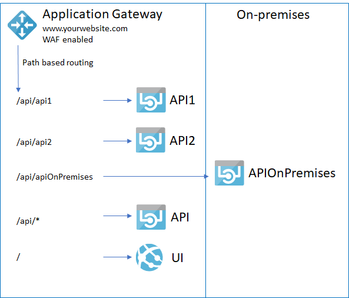

# Application Gateway

Application Gateway is a load balancer for web applications running on OSI layer 7, supporting HTTP, HTTPS, SSL termination, WebSocket and HTTP/2.  It supports routing based on URL paths. Moreover, it adds protection to web applications with web application firewall ([WAF](https://docs.microsoft.com/en-us/azure/application-gateway/application-gateway-web-application-firewall-overview)) which is based on OWASP rules.
It is **not a complete reverse proxy solution**. It cannot transform requests (query strings, paths), modify backend based on client IPs or headers, among other features found in mature reverse proxy solutions.

This pattern can be used in scenarios where all resources for an application  reside in the same domain (i.e. &lt;your-website&gt;, &lt;your-website&gt;/api, &lt;your-website&gt;/images) but are deployed in different Azure web sites allowing you to decouple the application code (i.e. each api/xxx is a different ASP.NET core application, deployed separately).



Creating application gateways can be done directly in Azure Portal. However there is no option to select the routing type, using "Basic". For the scenario we explaned above the rule type should be "Path-based" and that is exactly what the template below does.

<a href="https://portal.azure.com/#create/Microsoft.Template/uri/https%3A%2F%2Fraw.githubusercontent.com%2Ffbeltrao%2Fazdeploy%2Fmaster%2Fapplication-gateway%2Ftemplate.json" target="_blank">
    
</a>

## Adding Routes

Once the deployment of the application gateway is finalized you should add the web sites (backend pool) and routes (route rules) that should be handled by the application gateway. To make this process easier use the provided PowerShell script.

### Adding a route from an Azure web site

```powershell
.\AddSiteRoute.ps1 -resourceGroupName MyResourceGroup -applicationGatewayName MyAppGateway -webSiteName "MyCustomersApi" -paths "/api/customers","/api/customers/*"
```

This will route &lt;applicationGateway-ip-or-fqdns&gt;/api/customers to "MyCustomersApi.azurewebsites.net/api/customers"

### Adding a route from an external web site

```powershell
AddSiteRoute.ps1 -resourceGroupName MyResourceGroup -applicationGatewayName MyAppGateway -externalURI "thecatapi.com" -paths "/api/categories","/api/categories/*"
```

This will route the &lt;applicationGateway-ip-or-fqdns&gt;/api/categories/list to http://thecatapi.com/api/categories/list

### Defining where the path will be added

The path rules will be solved in the order in which they are defined. To control where the path rule is added use the parameter "routePosition" with possible values

- "first": will add in the top of the list (default behavior)
- "last": will add to the end of the list
- "secondLast": will add before the last element (in cases where the last element handles all missing cases)

### Protecting the Azure Web Sites from being accessed directly

If you wish to protect your azure web sites from requests not coming from the application gateway check [this article](https://blogs.msdn.microsoft.com/mihansen/2018/02/15/web-app-with-vnet-only-access-using-app-gateway-powershell-automation/).

Keep in mind that the proposed solution is not optimal because it relies on whitelisting the application gateway IP in each web site. The problem is that application gateway IP is dynamic, thus the underlying web sites might block requests if the application gateway IP does change.